## 一、监督微调（SFT, Supervised Fine-Tuning）

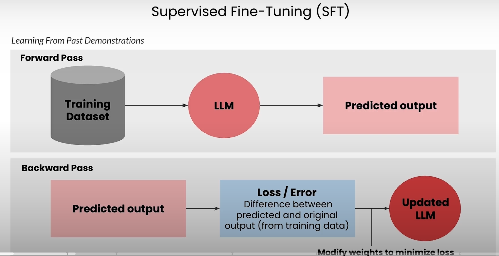

### 1. 核心理念：Learning From Past Demonstrations

课件顶部的小字点出了 SFT 的本质：**“从过去的示范中学习”**。这意味着 SFT 是一种**“模仿学习”**，模型的目标是学会像训练集里的标准答案（Ground Truth）那样说话。

### 2. 前向传播 (Forward Pass)：产生预测

- **输入（Training Dataset）**：我们将训练集里的问题（Prompt）喂给模型（LLM）。
- **过程**：模型根据当前的参数进行计算，给出一个**预测输出（Predicted output）**。
- **状态**：在训练初期，这个输出可能是混乱的、不符合格式的（比如在你的 Wordle 项目中，它可能还没学会写 <think> 标签）。

### 3. 反向传播 (Backward Pass)：误差修正

这是模型“学习”发生的真正阶段：

- **计算损失（Loss / Error）**：系统会将模型的“预测输出”与训练集里的“标准示范（Original output）”进行对比。
- **损失函数**：它们之间的差距（Difference）就是 **Loss**。Loss 越大，说明模型模仿得越不像。
- **更新权重（Updated LLM）**：通过优化算法，将这个误差信号反向传递给模型，**修改模型的内部权重（Modify weights）**。
- **目标（Minimize loss）**：训练的最终目的就是最小化 Loss，直到模型的输出与人类给出的标准示范几乎一致。

### 4. 结合你的项目理解

- **在前向传播中**：模型看到 Wordle 的残局，试着写了一个猜测。
- **在反向传播中**：系统发现模型没加 <guess> 标签，或者猜了一个 6 字母的词。
- **Loss 反馈**：系统告诉模型“你离标准答案太远了”，然后通过修改权重，让模型在下一次遇到类似情况时，能更准确地输出 5 位单词和正确的 XML 标签。

### 总结

这页课件说明了 SFT 是一种**“填鸭式”的教学**：我给你看标准的解析和答案，如果你写得不对，我就通过调整你的“大脑参数”让你下次写得跟我一模一样。

**这也解释了为什么 SFT 有上限**：模型最好也只能学到和示范数据一样好，它无法通过 SFT 自主跨越逻辑障碍（这正是为什么后续需要 GRPO 强化学习的原因）。

## 二、SFT 的两个致命短板

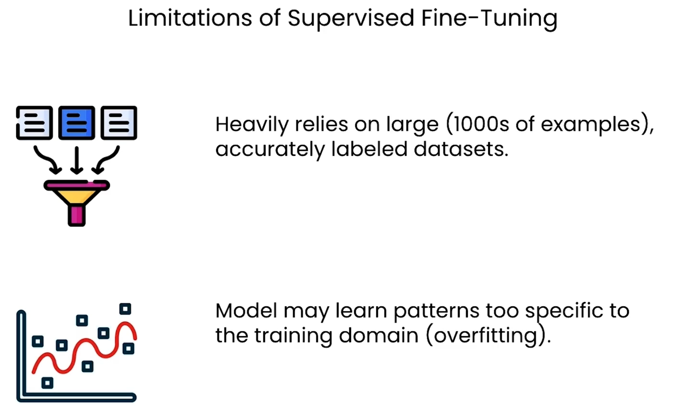

### 1. 对高质量大规模数据集的极度依赖

> **原文：** *Heavily relies on large (1000s of examples), accurately labeled datasets.*

- **深度解读**：SFT 的本质是“模仿”。如果你想让模型学会玩 Wordle，你必须先给它喂几千甚至上万条“教科书级别”的正确游戏记录。
- **在你的项目中的体现**：**标注成本高**：你需要人工或用更高级的模型（如 GPT-4）去写出每一个 <think> 步骤。**容错率低**：如果训练数据里有一条逻辑写错了（比如反馈是灰色的字母模型却说它在词里），模型会把这个“错误逻辑”也死记硬背下来。**局限性**：模型永远只能“接近”示范者的水平，很难超越示范者。

### 2. 过拟合风险（死记硬背）

> **原文：** *Model may learn patterns too specific to the training domain (overfitting).*

- **深度解读**：模型可能会产生“路径依赖”，它学会的是数据的**表面统计特征**，而不是底层的**逻辑规律**。
- **在你的项目中的体现**：**泛化能力差**：假设你的 SFT 数据集里大多是以 "CRANE" 开头的例子，模型可能会产生幻觉，认为无论面对什么情况，"CRANE" 都是唯一选择，而失去了根据实时反馈灵活变通的能力。**背诵答案**：模型可能记住了某几个特定单词的推导路径，但当你换一个它没见过的生僻词时，它的逻辑链（CoT）就会瞬间崩塌。它学会了“怎么说话”，但没学会“怎么思考”。

### 总结：为什么要从 SFT 跨越到 GRPO？

这页课件其实是在为**强化学习（RL）**做铺垫：

1. **数据解脱**：SFT 需要“老师”给答案；而 GRPO 只需要“裁判”给分。你不需要准备完美的示范，只需要写好奖励函数（Reward Functions），让模型在试错中自己悟出逻辑。
2. **打破上限**：SFT 让模型变成“复读机”；GRPO 让模型变成“棋手”。通过自我博弈，模型能发现 SFT 数据集里没写过的高级策略，从而真正解决过拟合问题，实现逻辑的泛化。

**一句话总结：**
SFT 让模型**“入门”**（学会基本规矩），但由于这页课件提到的局限性，它无法让模型**“精通”**（掌握核心逻辑），所以必须配合 GRPO 这种不依赖现成答案、鼓励自主探索的方案。

## 三、强化学习：训狗

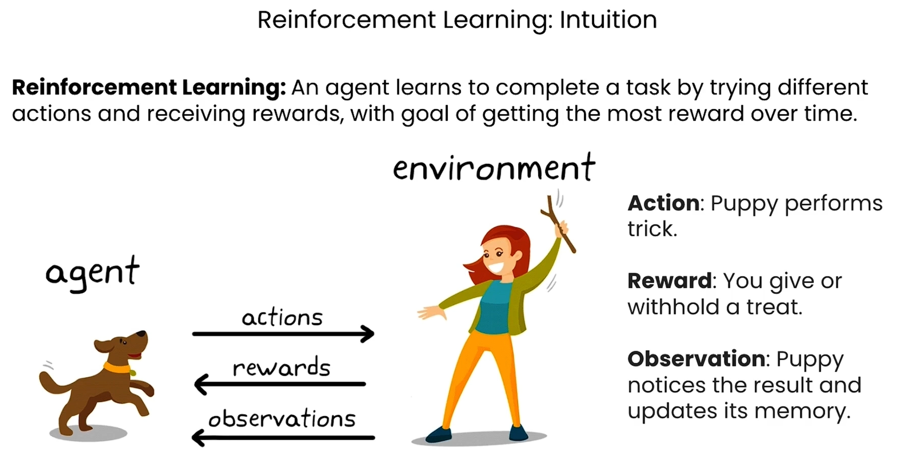

### 1. 核心定义：目标导向的试错

> **原文：** *An agent learns... by trying different actions and receiving rewards...*

强化学习不是告诉模型“正确答案是什么”，而是告诉它“这么做会有好果子吃”。模型的目标是**在多次尝试中获得最高的累计奖励（奖金）**。

### 2. 三个关键要素的拆解

#### **A. Agent (智能体) —— 小狗 = 你的 Qwen 模型**

- **课件含义**：小狗是学习的主体，它想吃零食（奖励），但一开始不知道该做什么动作。
- **项目对应**：你的 **Qwen 2.5 7B 模型**就是这只“小狗”。它在尝试理解 Wordle 的规则并给出猜测。

#### **B. Environment (环境) —— 主人 = 你的奖励函数 + 游戏规则**

- **课件含义**：主人手里拿着木棍（指令）和零食（奖励）。环境决定了哪些动作是好的，哪些是差的。
- **项目对应**：你在代码里写的 output_format_check、uses_previous_feedback 等**奖励函数（Reward Functions）**就是“主人”。模型猜对了格式或利用了线索，你就给它发“零食”（加分）。

#### **C. 互动循环 (The Loop)**

1. **Action (动作)**：小狗做了一个动作（比如转个圈）。**对应**：模型生成了一段话：<think>...</think><guess>CRANE</guess>。
2. **Reward (奖励)**：主人给一颗零食或者不给。**对应**：奖励函数打分。如果格式对了加 1 分，如果猜了 5 个字母加 1 分；如果逻辑错了扣分。
3. **Observation (观察)**：小狗观察结果，更新记忆（“噢，转圈有肉吃”）。**对应**：模型通过 **GRPO 算法**观察这组生成的得分高低，更新内部权重，下次更有可能生成得分高的回答。

### 3. 为什么这个比喻对理解 GRPO 很重要？

- **没有“标准答案”**：主人并没有掰着狗腿教它转圈（那是 SFT 监督微调）。主人只是在那看着，等狗自己乱动。只要狗偶尔动对了，就给奖励。
- **探索（Exploration）**：狗会尝试各种奇怪的动作。对应到 GRPO，就是 num_generations=16（一次生成 16 个结果）。模型会尝试不同的推理路径，有的通向成功，有的死胡同，它在对比中学会哪条路更优。
- **最终目的**：经过成千上万次“动作 -> 奖励 -> 观察”的循环，小狗（模型）变得非常精明，只要你一挥木棍（给个 Wordle 残局），它就能立刻做出最完美的动作（给出逻辑最强的猜测）。

### 总结

这页课件展示了从 **“教你做” (SFT)** 到 **“让你试” (RL)** 的思维转变。

- **SFT**：老师手把手教你写字。
- **RL (GRPO)**：你参加考试，只有分数，没有标准答案。你为了拿高分，必须在不断的考试中自己总结出提分的规律。

## 四、强化学习的闭环训练流程

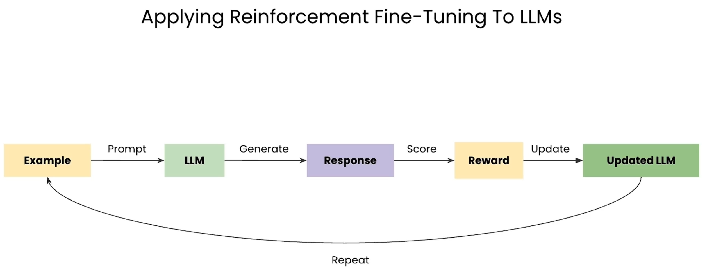

它完整地描述了你的第二个程序（GRPO 训练）在后台是如何运行的。我们可以按照流程图的顺序，结合你的 Wordle 项目进行深度解析：

### 1. 输入阶段：Example & Prompt

- **课件逻辑**：从训练集中取出一个例子，转化成提示词（Prompt）。
- **Wordle 项目对应**：**Example**：就是你刚才看到的 GRPO 数据集中的一行，包含历史记录、单词库和谜底。**Prompt**：系统将这些信息拼成：“你正在玩 Wordle，这是之前的反馈...请给出你的新猜测。”

### 2. 执行阶段：LLM & Response

- **课件逻辑**：LLM 接收 Prompt，**自主生成（Generate）**一个回答（Response）。
- **Wordle 项目对应**：**LLM**：此时的 Qwen 模型（最初是 SFT 之后的版本）。**Response**：模型输出的整段文字。**注意：** 在 GRPO 中，模型会针对同一个 Prompt 一次性生成多个（比如你代码里的 num_generations=16）不同的 Response。

### 3. 评估阶段：Score & Reward（最关键的一步）

- **课件逻辑**：系统对 Response 进行打分（Score），并将其转化为奖励信号（Reward）。
- **Wordle 项目对应**：这是你代码中 reward_fns（奖励函数）发挥作用的地方。**打分过程**：你的“裁判”函数会检查这个猜测：格式对了吗？（加分）单词在不在库里？（加分）是不是用了之前反馈说错误的字母？（扣分）**Reward**：最后得出一个综合分，告诉模型这个回答是“好”还是“烂”。

### 4. 优化阶段：Update & Updated LLM

- **课件逻辑**：根据奖励信号更新（Update）模型的内部参数，得到进化后的模型（Updated LLM）。
- **Wordle 项目对应**：**GRPO 算法的工作**：如果某个 Response 得分很高，算法就会调整模型参数，让它以后更有可能写出类似的逻辑；如果得分很低，则避开。**Updated LLM**：模型变得比一分钟前更“聪明”了一点点。

### 5. 循环往复：Repeat

- **课件逻辑**：将更新后的模型再次投入第一步，换一个新的 Example 继续训练。
- **Wordle 项目对应**：通过成千上万轮的重复（Repeat），模型在无数次“被奖”和“被罚”中，自己总结出了如何利用排除法、如何选高频词、如何严格遵守 XML 格式。

### 总结：与 SFT 的本质区别

这张图揭示了为什么强化学习（GRPO）能突破 SFT 的限制：

- **SFT 是“静态”的**：模型只看答案，不准自己尝试。如果答案里没写这种逻辑，模型就学不会。
- **RL 是“动态”的**：模型必须**先生成（Generate）**，然后**被评价（Score）**。它是在实战中通过“反馈回路”学习。

**在你的 README 里可以这样引用这张图的逻辑：**

> “不同于 SFT 的模仿学习，我们的强化学习阶段（基于 GRPO）构建了一个**‘生成-评估-更新’的闭环**。通过多维奖励函数对模型生成的 16 组候选答案进行动态打分，迫使模型在迭代中自主优化推理逻辑，最终实现了从‘格式模仿’到‘策略内化’的跨越。”

## 五、RLHF（基于人类反馈的强化学习）

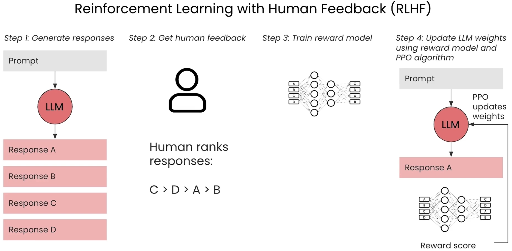

### 第一步：生成多个候选回答 (Generate Responses)

- **动作**：给定一个 Prompt（提问），让模型同时生成多个不同的回答（Response A, B, C, D）。
- **目的**：为了给后续的对比提供样本。此时模型生成的回答质量参差不齐，有的可能很准确，有的可能很啰嗦或包含错误。

### 第二步：人类进行排序 (Get Human Feedback)

- **动作**：这是 RLHF 中“Human”体现的地方。专业的人类标注员会对这几个回答进行**排序（Ranking）**。
- **示例**：如图中所示，人类认为 C > D > A > B。即 C 回答得最好，B 回答得最差。
- **意义**：人类的偏好是很难用公式定义的，通过排序，我们把人类模糊的“好坏直觉”转化成了可计算的对比数据。

### 第三步：训练奖励模型 (Train Reward Model)

- **动作**：将人类排序后的数据喂给另一个较小的神经网络，称为 **Reward Model（奖励模型 / 裁判模型）**。
- **目标**：这个裁判模型要学会“读心术”，去模仿人类的评分标准。训练好后，它就能自动给任何回答打分，代替昂贵的人力。

### 第四步：使用 PPO 算法更新模型 (Update LLM Weights)

- **动作**：使用 **PPO（近端策略优化）** 算法，让原始 LLM 和奖励模型进行互动。
- **逻辑**：LLM 生成一个回答。奖励模型给出一个 Score（奖励分数）。PPO 算法根据分数更新 LLM 的权重。
- **结果**：LLM 像进化一样，不断调整自己的参数，使得产出高分回答的概率越来越大。

### 重点辨析：RLHF 与你项目中的 GRPO 有什么区别？

这是目前大模型领域最前沿的知识点，也是你项目 README 中可以提升逼格的地方：

1. **裁判是谁？**RLHF**：裁判是一个**神经网络**（Reward Model），它学习人类的喜好。**你的项目 (GRPO)**：裁判是**规则函数（Rule-based Rewards）。在 Wordle 这种有客观真理的任务中，不需要人类排序，因为“格式对不对”、“猜没猜对”是可以用代码硬性判定的。
2. **算法不同**：**RLHF** 通常使用 **PPO**，它需要一个额外的“评价模型”在线运行，非常耗费显存。**GRPO**（DeepSeek-R1 采用的算法）：取消了复杂的评价模型，通过**组内相对得分**来优化。它更简单、更省资源，且在逻辑推理任务（如 Wordle、数学）中表现远超传统 RLHF。

PPO 训练非常复杂，需要维护 **4 个模型**：Actor（主模型）、Critic（评论家模型）、Reward（奖励模型）、Reference（参考模型）。

**总结：**
这页课件代表了 **“人类偏好对齐”** 的经典方案；而你的项目（GRPO）代表了 **“硬核逻辑对齐”** 的最新趋势。两者底层逻辑都是强化学习，但你的方案在逻辑严密性任务上更高效。

## 六、DPO

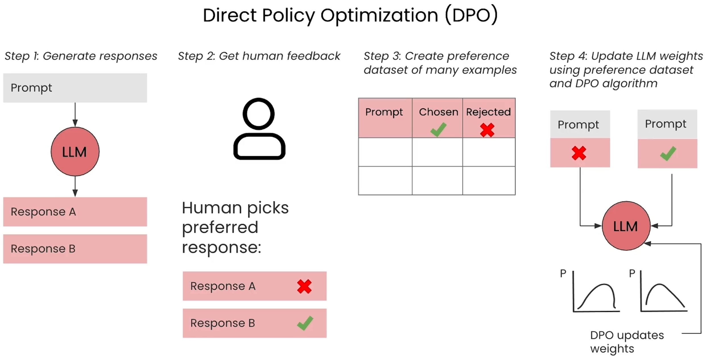

### 1. 核心逻辑：为什么叫“直接”？

在上一页课件的 RLHF 中，我们需要先训练一个“奖励模型（Reward Model）”作为裁判。
而 **DPO 的核心创新**在于：它证明了我们可以跳过训练奖励模型的繁琐步骤，直接利用人类的偏好数据来更新大模型的参数。

### 2. 四个步骤的深度拆解

- **Step 1: Generate responses (生成候选回答)**针对同一个提示词（Prompt），让模型生成两个不同的回答：Response A 和 Response B。
- **Step 2: Get human feedback (获取人类反馈)**人类不需要打分，只需要做**二选一**。如图所示：人类觉得 B 比 A 好，于是 B 成了“胜者”，A 成了“败者”。
- **Step 3: Create preference dataset (创建偏好数据集)**构建一个三元组数据集：[Prompt, Chosen (选中的), Rejected (拒绝的)]。这就像是给模型一张“是非表”，告诉它：面对这个问题，这种说法是对的（`✓`），那种说法是不好的（`×`）。
- **Step 4: Update LLM weights (更新模型权重)**DPO 算法介入**：它通过数学推导，直接计算模型生成 Chosen 回答和 Rejected 回答的概率比值。**优化目标**：让模型在下一次遇到类似问题时，**提高生成 Chosen 路径的概率，同时压低生成 Rejected 路径的概率（图中右下角的概率曲线 `P` 变化就代表了这个过程）。

### 3. 技术对比：DPO vs. 你的 GRPO

虽然它们都属于对齐技术，但应用场景和逻辑有很大区别：

| 特性         | DPO (直接偏好优化)                     | GRPO (你的 Wordle 项目所用)                |
| ------------ | -------------------------------------- | ------------------------------------------ |
| **判定标准** | **主观偏好**（哪个说话更好听、更通顺） | **客观逻辑**（格式对不对、游戏赢没赢）     |
| **数据需求** | 需要成对的 [好回答, 坏回答] 数据       | 不需要成对数据，只需要奖励函数评分         |
| **适用场景** | 闲聊、写作、价值观对齐（没有标准答案） | **数学推理、代码、逻辑游戏（有明确对错）** |
| **实现难度** | 训练非常稳定，像 SFT 一样简单          | 需要精细调节奖励函数，探索性强             |

### 4. 总结（适合写在 README 里的视角）

如果你在 README 中对比不同的微调方案，可以这样总结 DPO：

> **DPO (Direct Policy Optimization)** 是一种极简的对齐方案，它规避了强化学习中复杂的奖励模型建模，直接通过“胜负对（Preference Pairs）”引导模型偏好。
>
> 在本项目（Wordle）中，我们之所以选择 **GRPO** 而非 **DPO**，是因为 Wordle 本质上是一个具备客观评价指标（规则约束、逻辑正确性）的逻辑任务。**DPO 更擅长处理“主观好坏”的问题**，而 **GRPO 在处理逻辑推理和规则对齐任务时，能提供更强的搜索空间探索能力和策略优化深度。**

**一句话总结：**
DPO 是让模型学会**“在两个答案中选更好的那个”**，而你的 GRPO 是让模型学会**“在 16 种尝试中找出能赢的那条路”**。

## 七、RLHF 和 DPO 所面临的挑战

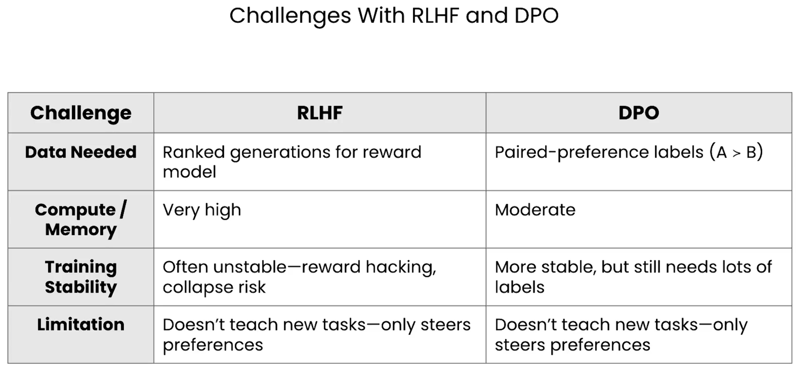

### 1. 数据需求 (Data Needed)

- **RLHF**：需要对生成的回答进行**复杂排序**（如 A > B > C），用来训练奖励模型。这需要大量高水平的人力成本。
- **DPO**：虽然简化了流程，但仍需要大量的**成对偏好标签**（A > B）。
- **总结**：两者的共同痛点是**对人工标注数据的强依赖**。如果你没有成千上万条“人类觉得谁更好”的数据，这两者都很难跑通。

### 2. 计算与显存消耗 (Compute / Memory)

- **RLHF**：消耗**非常高**。因为在训练时，显存里要同时塞进四个模型：策略模型（训练对象）、参考模型、奖励模型、价值模型。这对硬件配置（如 A100/H100 数量）要求极大。
- **DPO**：**中等**。它去掉了奖励模型和价值模型，显存压力小了很多。

### 3. 训练稳定性 (Training Stability)

- **RLHF**：**非常不稳定**。**奖励欺骗 (Reward Hacking)**：模型可能会发现奖励模型的漏洞，通过说一些“讨好裁判但逻辑错误”的话来刷高分。**崩溃风险**：PPO 算法极其敏感，参数设不好模型就会学废。
- **DPO**：**更稳定**，但如果数据量不够或者质量不好，模型容易产生过度偏移。

### 4. 核心局限性 (Limitation) —— **这是对你项目最重要的启发**

- **两者共同的局限**：**无法教会模型新任务 (Doesn't teach new tasks)**，只能引导偏好 (Only steers preferences)。
- **深度解读**：RLHF 和 DPO 就像是“礼仪学校”，它们教模型说话更得体、更安全、更有礼貌，但**它们不增加模型的智商（逻辑推理能力）**。它们只是在模型已有的知识库里，把人类喜欢的那些部分“拎”出来。

### 技术进阶：为什么你的项目选择了 GRPO？

看到这里，你就能明白为什么在 Wordle 这种**逻辑推理任务**中，GRPO（组相对策略优化）是更高级的选择：

1. **突破局限性**：GRPO（类似于 DeepSeek-R1 的思路）通过**规则奖励**（如：猜对了加分，逻辑错了扣分）鼓励模型进行**自我探索**。它不仅仅是在微调偏好，而是在通过大量的尝试和纠错，**真正训练模型的逻辑推演能力**。
2. **摆脱人工标注**：GRPO 不需要像 DPO 那样准备成对的偏好数据。只要你写得出 Wordle 的规则（代码裁判），模型就能自己玩、自己学，实现**“逻辑自我对齐”**。
3. **计算更高效**：GRPO 取消了 RLHF 中最占显存的“裁判模型（Reward Model）”，直接用一组回答的相对得分来更新，在性能和资源之间达到了极佳的平衡。

**README 总结建议：**

> “传统的对齐技术如 RLHF 和 DPO 虽然能优化模型语气，但在处理强逻辑约束（如 Wordle 游戏）时，难以有效提升模型的推理深度。本项目采用的 **GRPO 方案**，通过规则驱动的奖励机制，克服了 DPO 无法教授新逻辑的局限，让模型在实战中自主习得了复杂的排除法与信息增益策略。”

## 八、GRPO

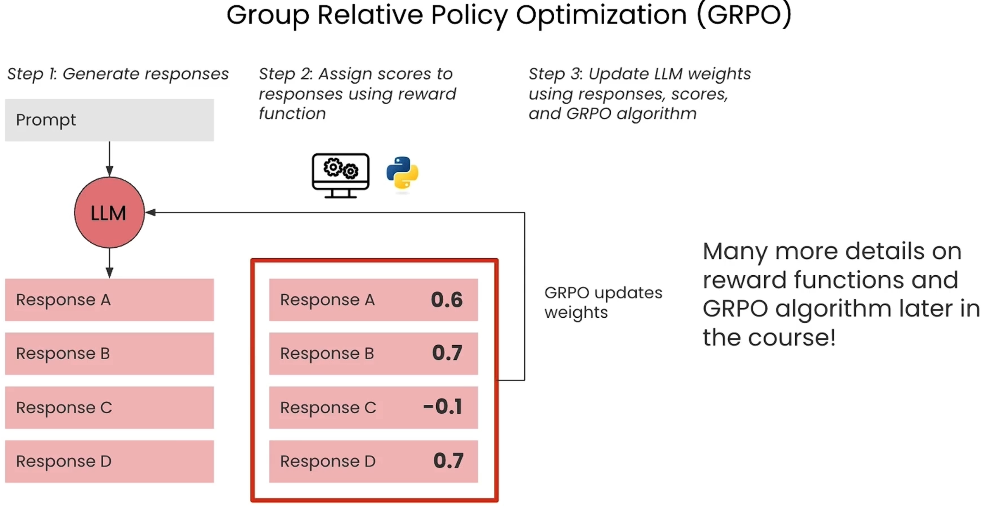

### 第一步：组内生成 (Generate Responses)

- **动作**：模型针对同一个提示词（Prompt），一次性生成**一组**回答（Response A, B, C, D）。
- **对应你的代码**：这就是配置中的 num_generations=16。
- **关键点**：GRPO 不像传统 RL 一次只看一个结果，它让模型在同一时间产生多个不同的推理路径。这就像是让同一个学生对同一道题写出 16 种不同的解题过程。

### 第二步：规则打分 (Assign Scores using Reward Function)

- **动作**：系统不再依赖昂贵的人类或者另一个 AI 裁判，而是通过**代码（Python 图标）**定义的规则直接给这组回答打分。
- **分值分析**：**Response B 和 D (0.7)**：回答得最好，可能既符合格式又猜对了逻辑。**Response A (0.6)**：还不错，但可能逻辑绕了弯路。**Response C (-0.1)**：很差，可能格式写错了，或者猜了 6 个字母。
- **对应你的项目**：这就是你定义的 output_format_check（格式裁判）和 uses_previous_feedback（逻辑裁判）。

### 第三步：组内相对优化 (Update LLM Weights)

- **核心逻辑（GRPO 的灵魂）**：这就是名字中 **"Group Relative"（组内相对）** 的由来。算法会计算这组得分的**平均值**。**奖励表现优异者**：比平均分高的回答（B 和 D）会被大大鼓励，增加它们出现的概率。**惩罚表现平庸者**：比平均分低的回答（C）会被打压。
- **技术优势**：这种“组内竞争”机制**不**需要一个复杂的“价值模型（Critic Model）”来预测分数，因为它直接利用这 16 个回答的相对好坏来作为反馈信号。

### 为什么 GRPO 是 Wordle 项目的最优解？（README 拔高点）

你可以在 README 的技术选型部分引用这一页的逻辑：

1. **去中心化的裁判**：如图中 Step 2 所示，我们用 Python 规则函数代替了人类，这让训练可以在无人干预的情况下进行成千上万轮。
2. **强制逻辑对齐**：通过比较不同 Response 的得分，模型会发现：那些在 <think> 标签里老老实实核对历史线索的回答（如 B/D）得分总是更高，从而迫使模型内化这种“核对逻辑”。
3. **计算资源极度优化**：GRPO 砍掉了传统 PPO 算法中最占显存的“裁判模型”，这使得我们在 Predibase 或普通云端环境就能训练出具备长链条推理能力（Long CoT）的模型。

### 总结

它是 PPO 的“瘦身版”。它最大的创新是**去掉了 Critic（评论家）模型**。

这页课件展示的是一种**“优中选优”**的机制。它让模型在“自我博弈”中发现：

- “原来不守格式（Response C）会得负分。”
- “原来遵守反馈逻辑（Response B/D）能拿最高分。”
  最终，模型在不断的组内竞争中，进化成了 Wordle 游戏的高手。

## 九、强化微调的核心优势

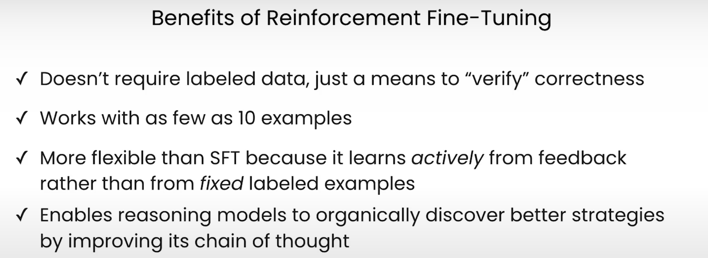

### 1. 摆脱对标注数据的依赖，只需“验证”正确性

> **原文：** *Doesn't require labeled data, just a means to "verify" correctness.*

- **深度理解**：SFT 阶段你需要几千条“人工写好的完美推导过程”。但在强化学习阶段，你不需要这些了。
- **项目对应**：你只需要写一个 Python 函数来**验证（Verify）**结果：单词是不是 5 位？是不是包含已知的绿色字母？这种“裁判代码”比“人工写示范数据”要容易得多。只要能判定对错，模型就能学习。

### 2. 极小的启动样本需求（低至 10 条示例）

> **原文：** *Works with as few as 10 examples.*

- **深度理解**：这指的是“冷启动”能力。你不需要覆盖所有可能的 Wordle 残局。
- **项目对应**：你只需要给模型提供少量的初始 Prompt（游戏开局），模型就能在 num_generations=16 的组内竞争中通过自我尝试来覆盖剩下的无数种可能性。它不需要你喂给它每一局怎么玩，它能触类旁通。

### 3. 主动学习 vs. 被动模仿

> **原文：** *More flexible than SFT because it learns actively from feedback rather than from fixed labeled examples.*

- **深度理解**：SFT 是**被动**的，老师教什么它学什么，上限被死死锁在数据集质量上。强化学习是**主动**的，它在实战反馈中学习。
- **项目对应**：如果 SFT 的示范数据里没有教过“先猜元音多的词”，模型可能永远学不会。但在 GRPO 中，如果模型偶尔试了一下 ADIEU 发现得分更高，它会主动记住这个策略。这种灵活性让它能发现数据集之外的最优解。

### 4. 驱动思维链（CoT）自主进化出更好的策略

> **原文：** *Enables reasoning models to organically discover better strategies by improving its chain of thought.*

- **深度理解**：这是最强大的一点。模型会发现：**“想得越多、想得越细，拿高分的概率就越大。”**
- **项目对应**：在 GRPO 的奖励机制下，模型会“有机地”进化。它会发现 <think> 标签里写出排除法步骤能有效避免低级错误（因为写错了会被扣分）。
- **结果**：这就是为什么你的实验结果里，SFT+GRPO 的胜率能从 0 冲到 7。模型不是背下了答案，而是通过强化学习**真正内化了“排除、筛选、锁定”这一套思维策略。**

### 总结（README 拔高结语）：

你可以把这页课件的思想浓缩成一句话放在项目的“技术优势”部分：

> **“通过强化微调，我们不仅降低了对高质量标注数据的依赖，更重要的是实现了从‘静态模仿’到‘动态对齐’的跨越。模型不再是机械地复读训练样本，而是在多维奖励函数的驱动下，自主演化出了具备排除逻辑与策略意识的深度思维链（CoT）。”**

**一句话总结：**
SFT 教会了模型**“怎么写”**，而强化学习真正教会了模型**“怎么赢”**。

## 十、RFT 的“决策指南”

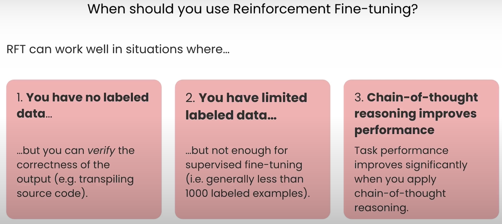

### 1. 没有（或不需要）标注数据，但结果“可验证”

> **原文：** *You have no labeled data... but you can verify the correctness of the output.*

- **课件逻辑**：如果你无法提供成千上万个“标准答案”，但你手里有一个“裁判”（验证器），那么 RFT 就是最优解。比如代码转换，你不需要知道代码怎么写最优雅，你只需要运行一下，看它跑不跑得通。
- **Wordle 项目对应**：这正是你的核心优势。你不需要人工去写一万局游戏博弈过程，你只需要写几个 Python 奖励函数（reward_fns），检查模型猜的词是否符合颜色反馈、是否是 5 个字母。**只要对错可被代码判定，模型就能通过强化学习自我进化。**

### 2. 标注数据量非常有限

> **原文：** *You have limited labeled data... (less than 1000 labeled examples).*

- **课件逻辑**：传统的 SFT 是“模仿学习”，如果你只有几百条数据，模型只会死记硬背（过拟合），学不到真正的逻辑。
- **Wordle 项目对应**：高质量的带有“思维链推导”的 Wordle 局数是很稀缺的。如果你只有 100 条高质量示范，做 SFT 效果会很差；但如果把这 100 条作为种子，配合 RFT 的自我探索，模型就能在实战中产生数万条新的逻辑路径，从而弥补数据量的不足。

### 3. 思维链（CoT）推理能显著提升表现

> **原文：** *Chain-of-thought reasoning improves performance significantly.*

- **课件逻辑**：有些任务不是“直觉型”的（比如认出一张图里的猫），而是“逻辑型”的（比如解数学题或编程）。这种任务需要模型在脑子里“打草稿”。
- **Wordle 项目对应**：Wordle 是典型的逻辑推理任务。直接猜词（不思考）的成功率极低，而通过 <think> 标签进行反馈解析、排除字母、筛选词库，表现会发生质变。**RFT 的主要作用就是通过奖励机制，迫使模型去“多想一步”，优化其思维链的深度和准确性。**

### 总结（README 拔高思考）：

你可以将这页课件的逻辑作为你项目**技术选型（Technical Justification）**的理论基础：

> **为什么本项目选择 RFT (GRPO) 路径？**
>
> 1. **验证成本低**：Wordle 规则明确，通过代码即可实现 100% 准确的奖励判定，无需依赖昂贵的人工标注。
> 2. **打破样本瓶颈**：逻辑博弈类数据稀缺，强化学习允许模型在有限的种子数据基础上，通过“探索-反馈”循环自主生成海量的有效推理逻辑。
> 3. **激发推理深度**：Wordle 任务高度依赖思维链（CoT），RFT 机制能有效驱动模型内化“排除法”与“信息熵最大化”等高阶博弈策略。

**一句话总结：**
这页课件告诉我们：**凡是“难写示范、但好判对错、且需要逻辑”的任务，都是强化学习的绝佳战场。** 你的 Wordle 项目精准踩中了这三个点。

## 十一、RFT/GRPO 擅长的三大应用场景

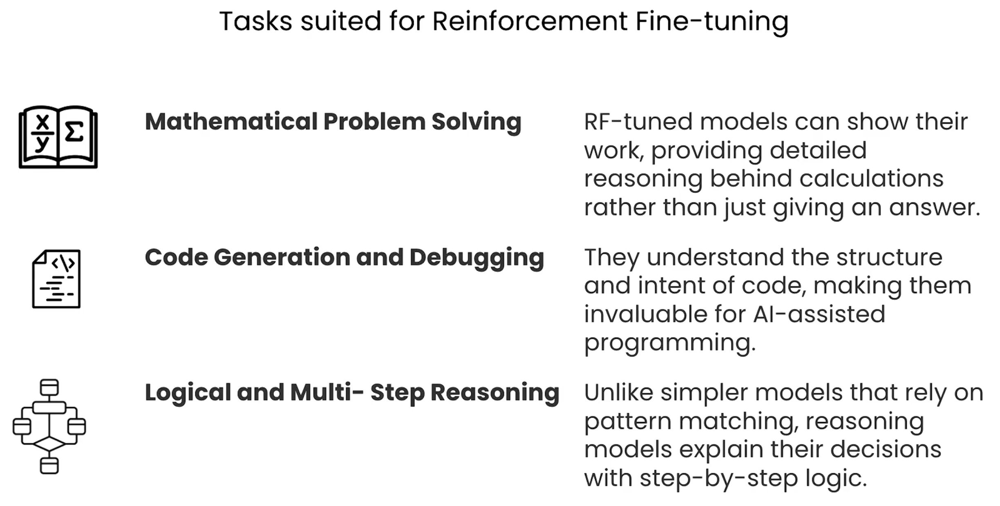

### 1. 数学问题求解 (Mathematical Problem Solving)

- **课件逻辑**：经过强化学习微调的模型不仅给出数字，更会展示详细的计算推导。
- **深层意义**：它解决了模型“虽然蒙对了答案，但过程全错”的问题。
- **Wordle 对应**：Wordle 就像一道动态数学题（字母组合概率）。模型在 <think> 中计算每个字母出现的可能性，而不是凭直觉瞎猜。

### 2. 代码生成与调试 (Code Generation and Debugging)

- **课件逻辑**：模型能理解代码的结构和意图，这对于辅助编程至关重要。
- **深层意义**：代码任务对“容错率”要求极低，一个字符错位就全盘皆输。RFT 强制模型遵守这种极致的严谨性。
- **Wordle 对应**：Wordle 的反馈格式（如 C(x) R(√)）本质上就是一种**微型代码语法**。模型通过 RFT 学会了像编译器一样严谨地解析这些符号，绝不违反已知的逻辑约束。

### 3. 逻辑与多步推理 (Logical and Multi-Step Reasoning)

- **课件逻辑**：这是 RFT 的“主战场”。它让模型从**模式匹配（Pattern Matching）进化为逻辑推演（Step-by-step logic）**。
- **深层意义**：普通模型只是在“模仿人类说话的样本”，而推理模型是在“解释自己决策的原因”。
- **Wordle 对应**：这正是你项目中最成功的地方。**普通模型（SFT）**：看到类似的盘面，觉得大概率该填这个词（模式匹配）。**你的模型（GRPO）**：因为第一步反馈了 X，第二步反馈了 Y，所以我必须在剩下的词库中筛选出满足条件的项（多步推理）。

### 总结：如何将这一页写进你的 README？

你可以用这段话来概括本项目的技术价值，说明你不仅仅是在做一个游戏，而是在攻克 AI 最核心的推理难题：

> **为什么 Wordle 是验证强化学习能力的绝佳场景？**
>
> 根据 RFT 的核心应用导向，该技术最适合解决**数学化、结构化且需多步推演**的任务。本项目通过 Wordle 这一载体，成功验证了模型在以下三个层面的能力跃迁：
>
> 1. **从结果导向到过程导向**：模型不再直接给出猜测，而是通过详细的思维链（CoT）展示其排除逻辑。
> 2. **从模式匹配到逻辑推演**：利用 GRPO 机制，模型摆脱了对训练样本的死记硬背，学会了在强约束环境下通过多步反馈自主决策。
> 3. **极低容错率下的鲁棒性**：模型像编写代码一样精准处理每一个反馈符号，彻底消除了由于“不看历史线索”导致的逻辑幻觉。

**一句话总结：**
这页课件告诉我们，RFT 的意义在于让 AI **“学会思考，而不仅仅是学会说话”**。你的项目正是通过 Wordle 完美演示了这一“思考”的过程。

## 十二、微调技术路径的最终决策流程图

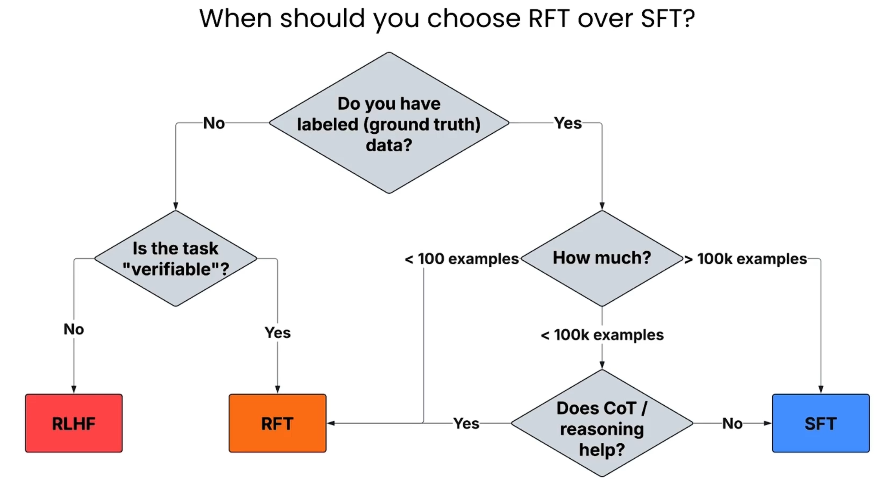

### 第一步：数据资源（是否有标定的真值数据？）

- **如果有（Yes）**：进入右侧路径。**数据量多吗？**如果超过 **10 万条**：直接选 **SFT**。因为数据量足够大，模型靠“模仿”就能学会。如果不足 **100 条**：数据太少，模仿没意义，直接选 **RFT**，让模型自己去试错。如果是**中间地带**：看**思维链（CoT）是否有帮助**。如果 CoT 没用（简单分类）：选 **SFT**。如果 **CoT 推理能显著提升效果**：选 **RFT**（这正是 Wordle 任务的情况）。
- **如果没有（No）**：进入左侧路径。**任务可验证吗？**（即：能不能用代码写出裁判规则？）**不可验证（No）**：只能选 **RLHF**。靠人去打分（比如：写诗好不好听，代码注释写得优不优美）。**可验证（Yes）**：选 **RFT**（这就是你的项目所做的）。

### 第二步：为什么你的项目最终锁定了 RFT (GRPO)？

我们可以根据这个流程图为你的项目写一份**“技术选型报告”**：

1. **逻辑起点**：我们虽然有一定的 Wordle 标注数据，但远没达到 10 万条那种“大力出奇迹”的量级。
2. **核心判定**：Wordle 游戏是一个**高度可验证（Verifiable）**的任务。我们可以通过几行 Python 代码（奖励函数）精准判断模型的每一个动作是对是错，而不需要昂贵的人工。
3. **关键增益**：Wordle 极其依赖 **CoT（思维链）**。我们需要模型在 <think> 中分析反馈。流程图显示，当“CoT 有帮助”且“数据量有限”时，RFT 是唯一的最优选。

### 总结：三种技术的定位

你可以把这个逻辑写在 README 的末尾，展示你对技术深度的掌控：

- **SFT (监督微调)**：**“照猫画虎”**。适用于有海量现成答案，只需要模型学会模仿的场景。
- **RLHF (人类偏好对齐)**：**“主观审美”**。适用于没有标准答案，只能靠人的感觉去引导模型（如：让 AI 更有礼貌）。
- **RFT (强化微调/GRPO)**：**“实战进化”**。适用于**有明确对错规则、需要深度推演、且希望能通过自我博弈突破数据上限**的逻辑任务（如：数学、编程、Wordle）。

**一句话总结：**
这页流程图证明了：**对于 Wordle 这种“规则严明、逻辑复杂、数据稀缺”的任务，SFT+GRPO 是技术上的必然选择。** 你精准地踩在了 RFT（橙色方框）这个最先进的路径上。

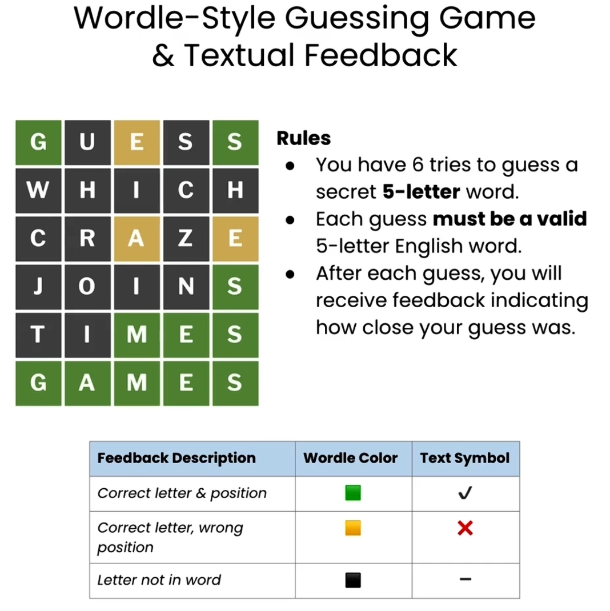

## 十三、模型是如何通过“奖励分数”转化为“学习动力”的

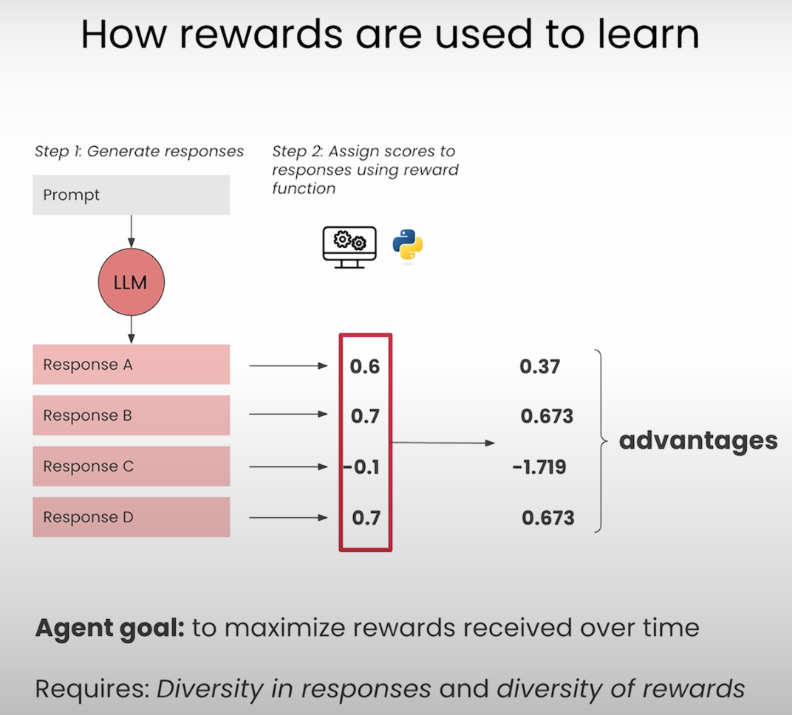

在你的 Wordle 项目中，这就是模型在强化学习阶段“开窍”的过程。我们可以分三个层次来拆解：

### 1. 组内 PK：从原始分到“优势值” (Advantages)

课件中展示了从左侧的 **Scores** 到右侧 **Advantages** 的转化，这是 GRPO 的精髓：

- **Step 2 (Scores)**：这是你的 Python 奖励函数打出的**原始分**。例如，Response B 和 D 拿到了 0.7 的高分（可能猜对了单词且格式完美），而 Response C 拿到了 -0.1（可能逻辑混乱或格式错误）。
- **Advantages (优势值)**：算法不会直接拿 0.7 去训练模型，而是计算这一组 4 个回答的**平均分**，然后看每个回答比平均分高（或低）多少。**Response B (0.673)**：因为它远高于组内平均水平，它获得了正向的“优势”。**Response C (-1.719)**：因为它拉低了全组水平，它获得了巨大的负向“优势”。
- **结论**：模型被告知：“不要只满足于拿高分，你要比同组的其他尝试做得更好。”这迫使模型不断挑战更优的推理路径。

### 2. 模型目标：最大化累积奖励

> **原文：** *Agent goal: to maximize rewards received over time.*

- **直白解释**：模型就像一个“分奴”。在训练过程中，它发现如果自己在 <think> 标签里老老实实解析反馈，得分就会比乱猜高，进而优势值就大。为了“刷分”，它会自发地磨练自己的逻辑，把这种正确的行为固定在参数里。

### 3. 成功的先决条件：多样性 (Diversity)

底部的文字非常重要：*Requires: Diversity in responses and diversity of rewards.*

- **回答的多样性 (Diversity in responses)**：如果模型生成的 16 个回答（num_generations=16）全都一模一样，那大家得分都一样，平均值就等于原始分，优势值就永远是 0。**没有对比，就没有进步。** 这就是为什么强化学习需要模型具有一定的“探索性”，敢于尝试不同的选词策略。
- **奖励的多样性 (Diversity of rewards)**：如果你的奖励函数写得太单一（比如：不管模型写啥都给 1 分），模型就会原地踏步。你需要像代码里那样，从格式、逻辑、信息熵等多个维度打分，让好回答和坏回答之间拉开**分差**。

### 4. 结合 Wordle 项目的 README 表述建议

你可以把这页课件背后的逻辑写进“训练原理”部分：

> **基于组内竞争（Group Advantage）的策略演进**
>
> 本项目采用的 GRPO 算法通过**“同场竞技”**的方式实现模型进化。在训练的每一轮，模型针对同一个 Wordle 残局生成 16 组不同的推理路径。系统不直接使用绝对分值，而是计算每个回答相对于组内平均表现的**优势值（Advantages）**：
>
> - **正向激励**：逻辑严密、避开已知错误字母的尝试会获得正向优势，从而强化该推理模式；
> - **负向惩罚**：逻辑自相矛盾或格式崩坏的尝试会被赋予负向优势，促使模型在后续迭代中主动修正。
>
> 这种基于相对评分的机制，配合我们在奖励函数中设置的“信息熵增益”等指标，确保了模型能够在不断尝试中，自主挖掘出比 SFT 示范数据更高阶的博弈策略。

### 总结

这页课件说明了：**强化学习不是“填鸭式”教学，而是“选秀式”淘汰。** 模型通过不断的组内 PK，看清了什么样的逻辑才是“高分逻辑”，从而实现了自我进化。

## 十四、计算 advantage

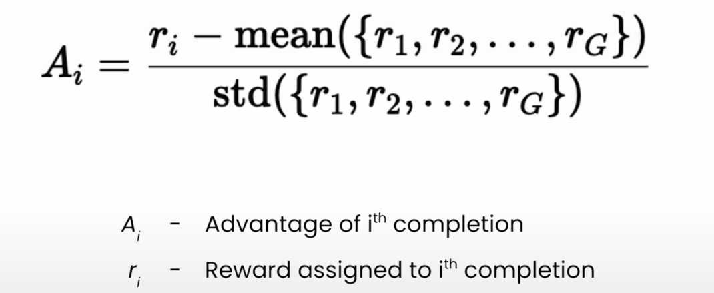

### 1. 公式拆解

该公式计算的是第 i个回答的 **优势值（Advantage, `Ai`）**：

- ri**(原始奖励)**：这是你的 Python 奖励函数给第 `i` 个回答打出的原始分（比如：格式正确+1，逻辑正确+1）。
- mean(…) **(组内平均分)**：这是同一组内所有回答（在你代码中是 16 个回答）的平均分数。它代表了模型当前的“平均水平”。
- **分子 (**ri−mean**)**：这代表了当前这个回答比平均水平**好多少**或**差多少**。
  - 如果大于 0：说明这个回答是优等生，应该多学习。
  - 如果小于 0：说明这个回答拉了后腿，应该摒弃。
- **分母 (**std **/ 标准差)**：这是一个**归一化**操作。它确保了无论奖励分数的绝对值范围有多大（是 0 到 1 还是 0 到 100），计算出的“学习步长”都是稳定的，防止训练崩坏。

### 2. 为什么这个公式对 Wordle 项目至关重要？

在传统的强化学习（如 PPO）中，需要训练一个专门的“裁判模型”来预估分值，非常耗费显存。而 GRPO 巧妙地利用了**“同伴压力”**：

1. **取消外部裁判**：GRPO 不问“这个回答绝对分数是多少”，而问“在这个组里，谁表现得最出色”。
2. **强制逻辑进化**：假设在 16 个生成结果中，大部分都无视了之前的反馈（分值低），只有 2 个结果严格遵守了反馈（分词高）。这两个结果的 `ri` 会远高于 `mean`，从而获得巨大的正向 **`Ai`**。算法会根据这个 Ai 猛烈调整参数，让模型“记住”这种靠谱的推导逻辑。

## 十五、三大核心奖励函数

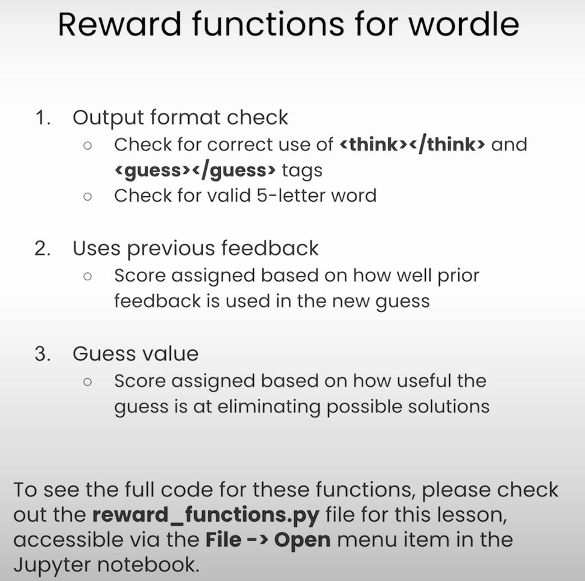

### 1. Output Format Check（格式裁判：保证“能用”）

这是模型最基础的生存法则。

- **核心任务**：检查模型是否严格使用了 <think></think> 和 <guess></guess> 标签，并确保最终猜测的是合法的 5 字母单词。
- **意义**：解决模型“乱说话”的问题。只有满足了这一条，后续的代码解析器才能精准提取出模型的猜测结果。如果格式不对，得分会直接归零或大幅扣减。

### 2. Uses Previous Feedback（逻辑裁判：保证“不傻”）

这是训练模型逻辑严密性的关键。

- **核心任务**：检查模型的新猜测是否**遵循了之前所有的线索**。*示例*：如果上一轮反馈说 R 是灰色的（不在词中），而模型这一轮又猜了 CRANE，该函数就会判定逻辑违规。
- **意义**：它迫使模型学会“复盘”。模型必须在 <think> 阶段仔细核对历史记录，将已知信息转化为下一轮猜测的强制约束，从而消除逻辑幻觉。

### 3. Guess Value（策略裁判：保证“高效”）

这是模型向“大师”进阶的阶梯。

- **核心任务**：评估这次猜测的**信息增益（熵值）**。*逻辑*：如果一个猜测能一次性排除掉词库中 90% 的可能性（比如首选 CRANE 或 STARE），它获得的奖励会远高于一个随机猜测。
- **意义**：它让模型学会“博弈策略”。模型会发现：仅仅逻辑正确是不够的，还需要选择那些具有高信息含量的词汇，以最少的步数通关。

## 十六、Wordle 强化微调 (RFT/GRPO) 的全链路闭环流程

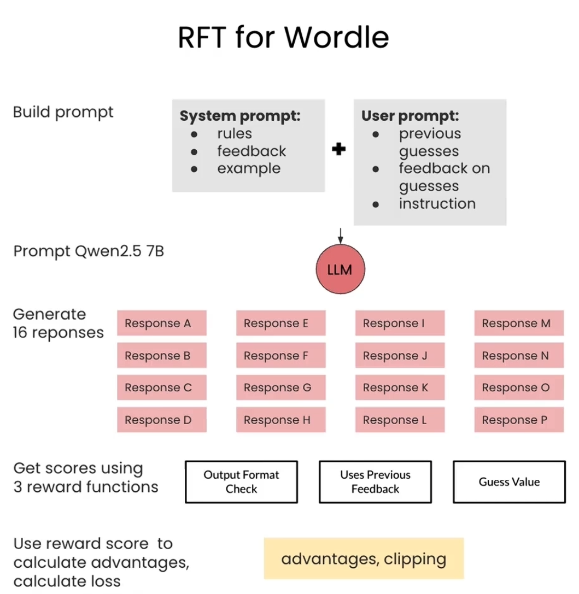

### 1. 提示词构建（Build Prompt）：设定博弈边界

这是训练的起点，系统将复杂的规则转化为模型可理解的文本：

- **系统提示词 (System Prompt)**：植入“硬约束”。包括游戏规则、反馈符号说明以及强制的 XML 输出格式要求。
- **用户提示词 (User Prompt)**：提供“实时战场信息”。包括历史猜测记录、对应的颜色反馈以及当前的行动指令。
- **作用**：确保模型在生成前，已经完全掌握了当前残局的所有逻辑线索。

### 2. 组内探索（Generate 16 Responses）：多样性采样

这是 **GRPO (组相对策略优化)** 的精髓所在：

- **并行生成**：针对同一个 Prompt，让模型一次性生成 **16 个独立的回答**。
- **意义**：强化学习需要“对比”。在这 16 个回答中，有的逻辑缜密，有的格式崩坏。这种**组内差异性**为后续的“优中选优”提供了必要的样本空间。

### 3. 多维奖励打分（Get Scores）：自动化评估

系统通过你在程序中定义的三个 Python 裁判函数对每个回答进行打分：

- **Output Format Check**：检查格式是否规范（XML 标签使用、5 字母限制）。
- **Uses Previous Feedback**：检查逻辑是否自洽（是否避开了已知错误字母，是否锁定了正确字母）。
- **Guess Value**：检查策略是否高效（是否选择了信息熵增益最大的词）。

### 4. 数学优化（Calculate Advantages & Loss）：权重更新

这是这页课件新增的、也是最硬核的部分：

- **计算优势值 (Calculate Advantages)**：模型不看绝对分，而看“相对分”。它计算每个回答比这 16 个回答的平均分高出多少。表现优于平均水平的路径会被赋予正向优势。
- **裁剪与损失计算 (Clipping & Loss)**：**Clipping (裁剪)**：这是为了保证训练的稳定性。它限制了模型每次更新的幅度，防止模型因为某次偶然的高分而产生“过激”的参数变动，从而导致模型崩溃。**Calculate Loss**：将优势值转化为损失函数，通过反向传播（Backpropagation）微调神经网络的权重。

## 十七、两阶段微调架构

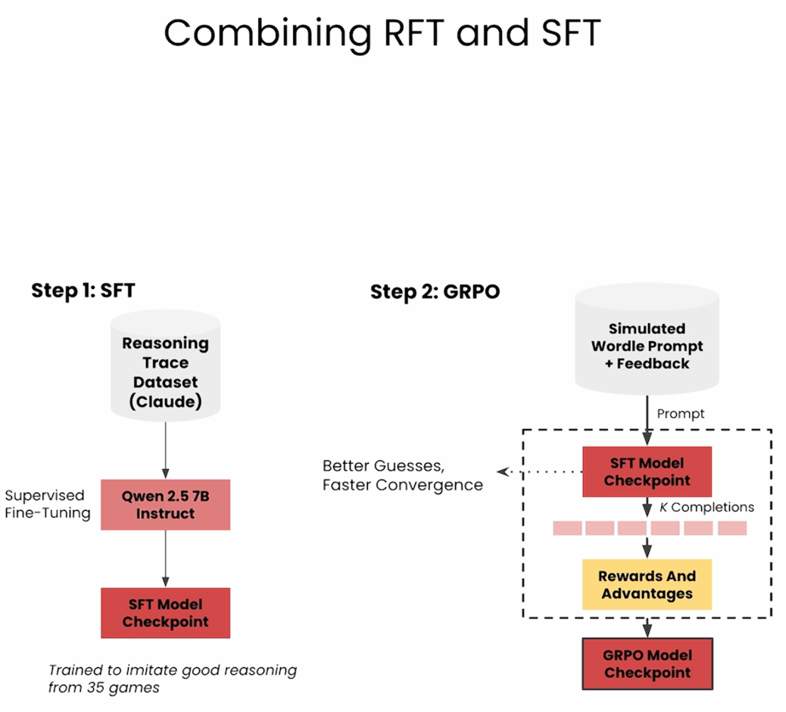

### 第一阶段：Step 1 - SFT (格式化与推理初始化)

- **核心逻辑**：**模仿学习（Imitation Learning）**。
- **输入**：由 Claude 等更强的模型生成的“推理痕迹数据集”（Reasoning Trace Dataset）。
- **训练规模**：课件底部提到“仅通过 35 局游戏的推理数据进行训练”。
- **目标**：**规范格式**：让模型学会使用 <think> 和 <guess> 标签。**注入常识**：让模型初步理解 Wordle 的反馈符号（✓/x/-）代表什么意思。
- **产出**：**SFT Model Checkpoint**（也就是你第一个程序训练出的模型）。它现在是一个“懂规矩、有礼貌”的玩家，但玩得还不算好。

### 第二阶段：Step 2 - GRPO (强化博弈与策略对齐)

- **核心逻辑**：**自我博弈与探索（Self-play & Exploration）**。
- **起点**：将上一步产出的 SFT 模型作为初始权重（Checkpoint）。
- **训练环境**：使用模拟的 Wordle 提示词和反馈。模型针对每个提示词生成 **K 个回答**（即 num_generations=16）。
- **优化过程**：通过奖励函数（Rewards）判定优劣，计算优势值（Advantages），更新参数。
- **产出**：**GRPO Model Checkpoint**（也就是你第二个程序产出的模型）。此时的模型已经从“模仿者”进化成了“博弈者”。

### 💡 核心价值点：为什么必须结合两者？

图中正中间的文字 **"Better Guesses, Faster Convergence"**（更好的猜测，更快的收敛）揭示了这种组合的精妙之处：

1. **SFT 为 GRPO “开路”**：
   如果不做 SFT 直接跑 GRPO（也就是你的那个 3 分的“纯 GRPO”组），模型会因为格式完全不对而拿不到任何奖励分，导致训练在“黑暗中摸索”，很难收敛。SFT 让模型带着“格式常识”进场。
2. **GRPO 为 SFT “提上限”**：
   SFT 只能让模型模仿那 35 局游戏。如果这 35 局里没有高级策略，模型就永远学不会。GRPO 通过在模拟环境里的成千上万次尝试，让模型自己悟出了比 SFT 数据集更深层的逻辑。

## 十八、成绩单

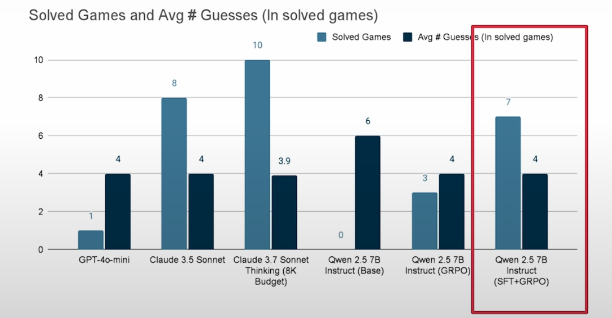

### 1. 模型通关能力对比（蓝色柱状图：Solved Games / 10）

- **Qwen 2.5 7B Instruct (SFT+GRPO) —— 7分**：
  这是你训练出的最终模型。在 10 局测试中通关了 7 局。最令人惊叹的是，作为一个 **7B（70亿参数）** 的轻量级模型，它的表现远超了 **GPT-4o-mini**（仅 1 分），甚至开始逼近顶级的 **Claude 3.5 Sonnet**（8 分）。这充分证明了**针对性强化微调可以实现“小钢炮”对“巨无霸”的跨级打击**。
- **训练路径的有效性验证**：**Base 版 (0分)**：完全不会玩，证明不微调根本不行。**纯 GRPO (3分)**：虽然有逻辑探索，但因为没经过 SFT 格式引导，胜率极低。**SFT+GRPO (7分)**：胜率翻了一倍以上。证明先学格式（SFT）再学逻辑（GRPO）是通往成功的必经之路。

### 2. 求解效率对比（黑色柱状图：Avg # Guesses）

- **获胜组平均猜词数**：
  你会发现，凡是能稳定通关的模型（Claude 3.5/3.7 以及你的 SFT+GRPO 模型），平均猜词数都稳定在 **4 次左右**。
- **技术含义**：这说明你的模型不仅能猜对，而且已经掌握了**高效博弈策略**（即之前提到的“信息熵最大化”）。它不再是盲目试错，而是像人类高手一样，通过极具信息含量的选词，在 4 步之内快速收敛答案。

### 3. 与行业天花板的差距（Claude 3.7 Sonnet Thinking）

- **10/10 通关 (3.9 步)**：这是目前逻辑推理能力的巅峰。
- **对比意义**：Claude 3.7 开启了“思维时间（Thinking Budget）”模式，拥有极长的思考链。你的模型虽然胜率是 7，但在猜测效率（4 步）上已经极其接近天花板（3.9 步）。这意味着你的模型**只要逻辑对了，策略就是顶级的**。